# Download Daytona VSCode Extension Today

<!--Two subtitles to select for article description section-->
#### Subtitle 1: Never leave your editor for a standardised developement environment

#### Subtitle 2: Download Daytona VSCode Extension for a Github Codespaces-like experience

Daytona's [VS Code extension](https://marketplace.visualstudio.com/items?itemName=daytonaio.daytona) is now available for download on VS Code

:::tip[!NOTE]
<!-- This is a callout group intended to be formatted like this: https://docs.github.com/en/get-started/writing-on-github/getting-started-with-writing-and-formatting-on-github/basic-writing-and-formatting-syntax#alerts-->
Daytona is an environment management platform any company can install company's own infrastructure. Most of remote standardised development environments are browser based IDEs, but Daytona enable your team to work together frictionless with a unified setting.
:::

With Daytona's VS Code extension, you will have a frictionless user experience to connect a remote SDE, by clicking on the extension icon.

## To install the Daytona extension in VSCode: 

A. From URL: 

You can click on this link to install [Daytona VSCode Extension](https://marketplace.visualstudio.com/items?itemName=daytonaio.daytona) and also make sure you have the [Remote SSH Extention](https://marketplace.visualstudio.com/items?itemName=ms-vscode-remote.remote-ssh) in your VS Code


B. Or download it directly in VSCode:

1. Go to VSCode
2. Open Extension view by pressing `Ctrl+Shift+X`(Windows) or `Command+Shift+X`(MacOS). 
3. (Optional) Search "Remote SSH" and install the Remote SSH extension in the VS Code extension market place:

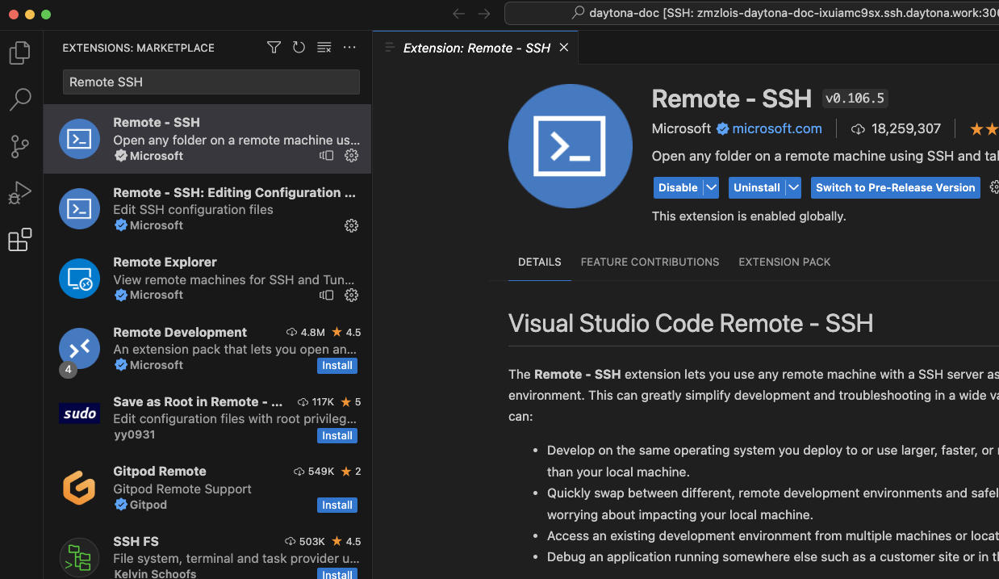

4. Search "Daytona", you will find: 

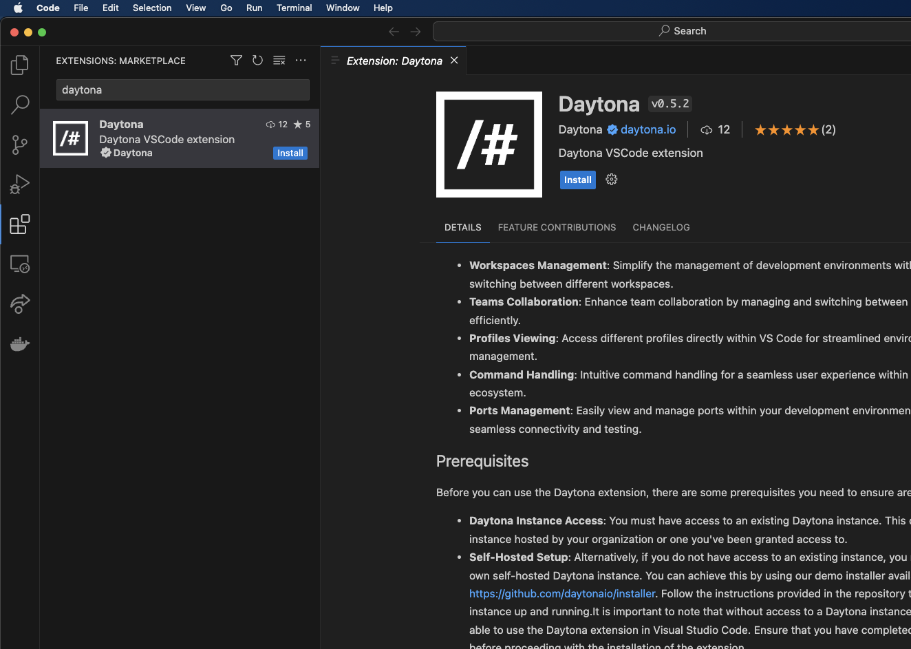


5. Hit install button: 

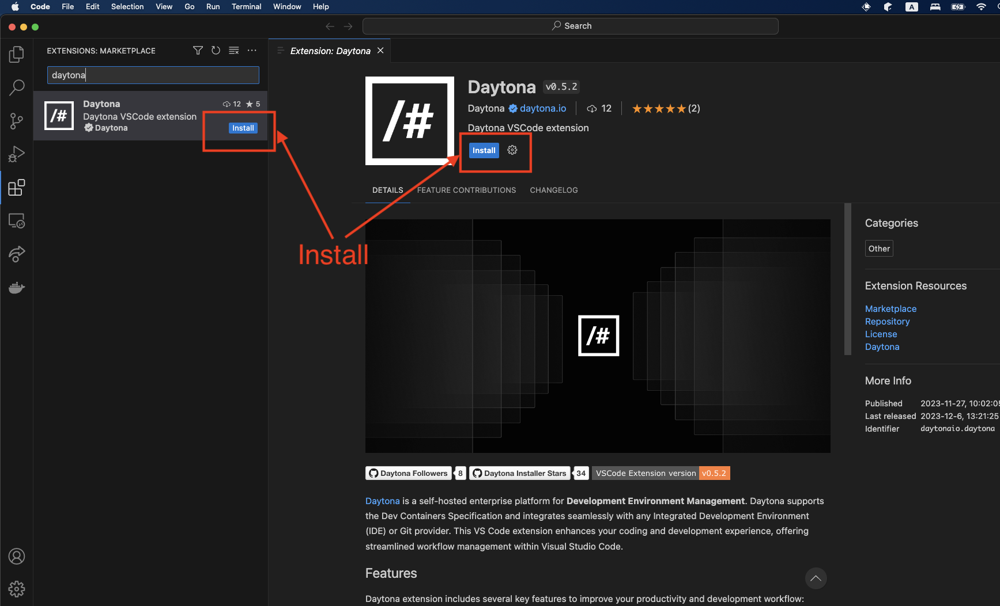


### Using it the first time

Navigate back to your Daytona Dashboard in browser with your workspace URL:

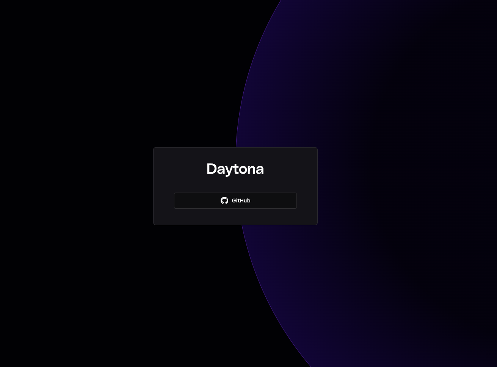


> Haven't install it? The link is here [Daytona Installer](https://github.com/daytonaio/installer), and make sure you updated it to the latest version for a better experience -- we update the installer very often. 

**If you need help, join our Slack community.**

[Join Daytona Slack Community](https://join.slack.com/t/daytonacommunity/shared_invite/zt-273yohksh-Q5YSB5V7tnQzX2RoTARr7Q)


### Default IDE configuration in dashboard

After log in, you will see the dashboard

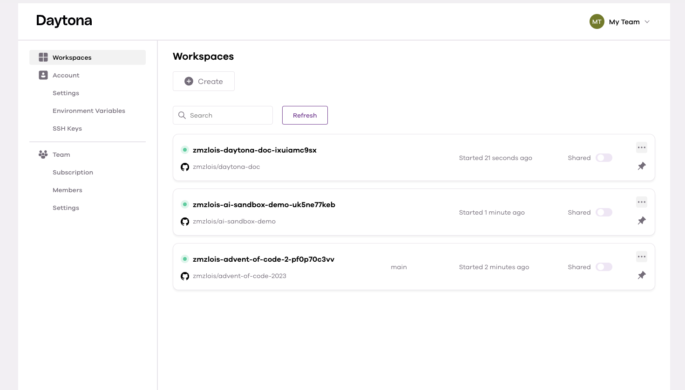

To select a default editor, click on the `Settings` tab on left navigation bar, 


You can choose VSCode or any editor from the Jetbrains group. But let's select `VS Code` for today.

<figure class="video_container">
  <video controls="true" allowfullscreen="true" poster="../../../video-poster.png">
    <source src="../../../pic-code-editor.mp4" type="video/mp4">
  </video>
</figure>

> On this dashboard, you can set the environment variables for this workspace, or set your public SSH keys to allow a secure connection with your Daytona workspace,or manageing your team settings and usage information. 

Once you have the extension and default editor set up, hit `Create` on the `Workspaces` page and import a repository. 

On right side of any one of your repository, click on the `...` and then `Open`

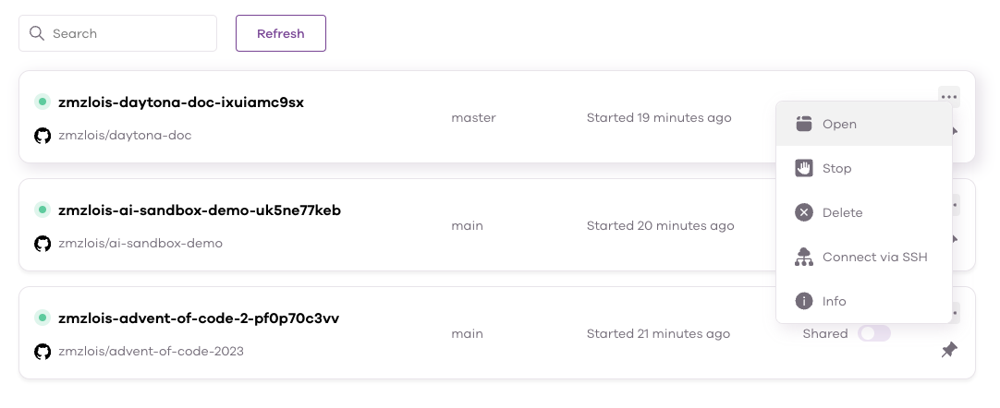

> And then confirm the editor of choice:


The browser will ask you
```
 "workspace.url" wants to open "Code"
```
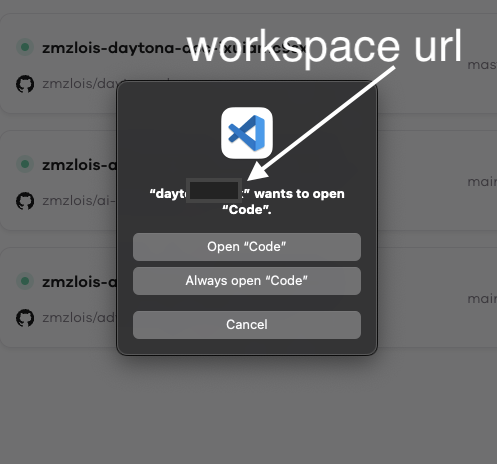

Click `Open` to continue. Once VSCode is opened, VSCode will ask you: 
```
Allow 'Daytona' extension to open this URI?
```
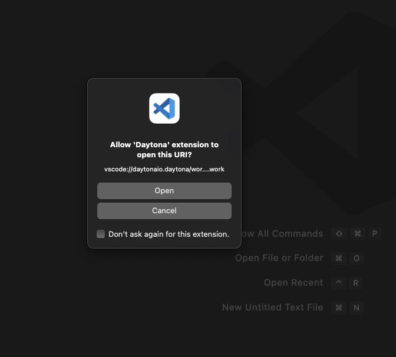

**Click Open** to continue. 

If you are connecting for the first time, VS Code might ask you to for an access grant: 

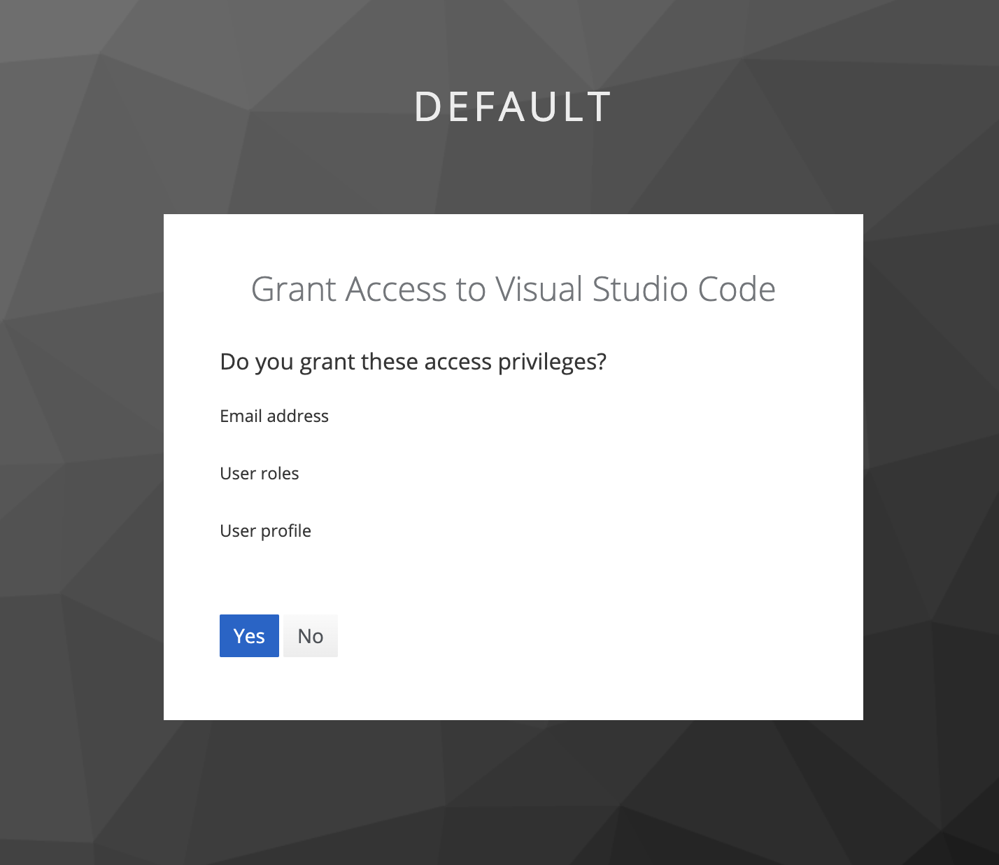

Click yes and you will be redirected to vscode:

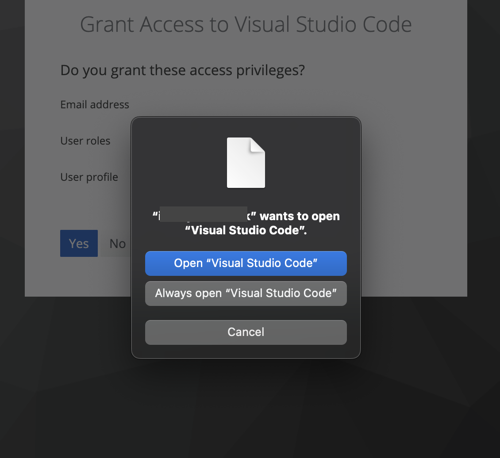

Your editor will then prompt you to enter an SSH config file, select the first one: 

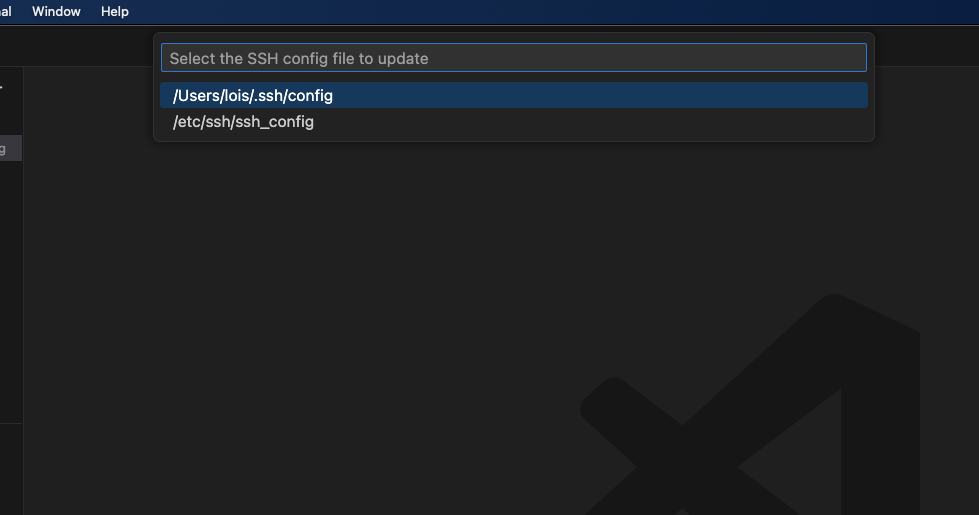

And now you are connected and ready to use Daytona in VS Code!


## A Github Codespaces-like experience

Once you are set up, whenever you open VS Code again, click on the Daytona extension shows up on the left. You can see the repositories showed up on in VSCode are synced with your Daytona workspace.


> When connecting to a repository, VS Code will ask you again for an SSH config file, always select the first: 
> 


## Install Daytona Extension Today

[Daytona VS Code Extension](https://marketplace.visualstudio.com/items?itemName=daytonaio.daytona)


---
Need help? [Join Daytona Slack Community](https://join.slack.com/t/daytonacommunity/shared_invite/zt-273yohksh-Q5YSB5V7tnQzX2RoTARr7Q)